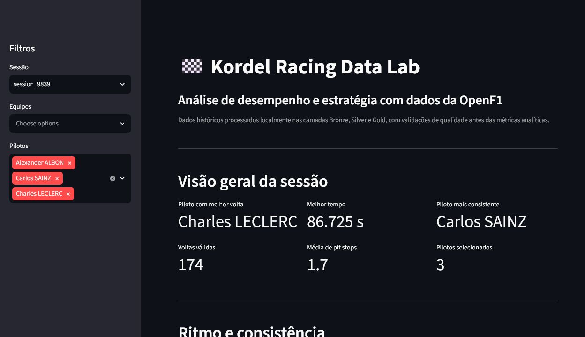
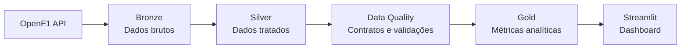

# Kordel Racing Data Lab

Pipeline local de dados de Fórmula 1 que transforma dados históricos da OpenF1 em tabelas analíticas confiáveis e um
dashboard interativo de desempenho e estratégia.

[](https://github.com/alankordel/kordel-racing-data-lab/actions/workflows/ci.yml)


## Preview



A captura usa os dados reais processados da sessão 9839. As instruções para atualizá-la estão em
[docs/assets/README.md](docs/assets/README.md).

## Principais funcionalidades

- ingestão configurável de oito endpoints históricos da OpenF1;
- armazenamento Parquet nas camadas Bronze, Silver e Gold;
- contrato e validações de qualidade para voltas antes das métricas Gold;
- relatórios JSON com erros, warnings e registros de exemplo;
- análises de ritmo, consistência, pneus e pit stops;
- dashboard Streamlit com filtros por sessão, equipe e piloto;
- testes sem internet, Ruff e integração contínua no GitHub Actions;
- amostra versionada da sessão 9839 em JSON e CSV.

## Arquitetura



Python 3.12+, requests, pandas, PyArrow, YAML, pytest, Ruff, Streamlit e Plotly. As decisões estão em
[docs/architecture.md](docs/architecture.md) e as tabelas em [docs/data_dictionary.md](docs/data_dictionary.md).

## Instalação

```bash
python -m venv .venv
# Windows
.venv\Scripts\activate
pip install -r requirements.txt
pip install -e .
```

## Execução

O exemplo configurado é a corrida de Abu Dhabi de 2025 (`meeting_key=1276`, `session_key=9839`):

```bash
python main.py
```

Para escolher outra sessão:

```bash
python -m kordel_racing.cli run --meeting-key 1276 --session-key 9839
```

Também é possível usar `--output-dir` e `--endpoints`. Configurações permanentes ficam em `config/settings.yaml`.

## Dashboard

```bash
streamlit run dashboard/app.py
```

O dashboard lê somente a camada Gold local. Ele apresenta KPIs de melhor volta e consistência, comparação de ritmo,
stints de pneus e pit stops, com filtros na barra lateral.

## Qualidade dos dados

O contrato de `laps` valida colunas obrigatórias, chaves não nulas, tipos numéricos, valores positivos e finitos e
unicidade de `session_key + driver_number + lap_number`. Duração nula é aceita com `WARNING`; erros críticos geram o
relatório `data/quality/laps_quality_<session_key>.json` e impedem a criação da Gold.

Detalhes e limitações estão em [docs/data_quality.md](docs/data_quality.md).

```bash
pytest --cov=src/kordel_racing
ruff check .
```

## Dados de exemplo

`data/samples/session_9839/json` contém respostas Bronze e metadados; `data/samples/session_9839/csv` contém as quatro
tabelas Gold. Para atualizar as amostras após executar o pipeline:

```bash
python scripts/export_samples.py --meeting-key 1276 --session-key 9839
```

## Estrutura do projeto

```text
config/                     configuração YAML
dashboard/                  aplicação Streamlit
data/                       camadas geradas e amostras versionadas
docs/                       arquitetura, qualidade e dicionário
src/kordel_racing/quality/  contratos, validadores e relatórios
src/kordel_racing/          cliente, transformações, métricas e CLI
tests/                      testes unitários e fixtures sintéticas
.github/workflows/          integração contínua
```

## Limitações e roadmap

A OpenF1 é uma fonte não oficial e pode alterar schemas. A degradação é descritiva e não controla tráfego, combustível,
clima, bandeiras ou diferenças de estratégia. O contrato atual valida apenas `laps` e ainda não verifica relações entre
datasets.

Concluído:

- [x] pipeline Bronze, Silver e Gold;
- [x] métricas analíticas e dashboard;
- [x] testes e integração contínua;
- [x] documentação de arquitetura;
- [x] contrato inicial para `laps`.

Próximos passos:

- [ ] contratos para os demais endpoints;
- [ ] validações entre datasets;
- [ ] testes opcionais de integração;
- [ ] análise de clima;
- [ ] execução opcional com Spark/Databricks;
- [ ] PostgreSQL como camada de serving;
- [ ] FastAPI;
- [ ] deploy público do dashboard.

## Aprendizados

O projeto demonstra separação entre extração e transformação, arquitetura medalhão, armazenamento colunar, contratos de
dados, observabilidade por relatórios, testes sem internet e métricas com limitações explícitas.
